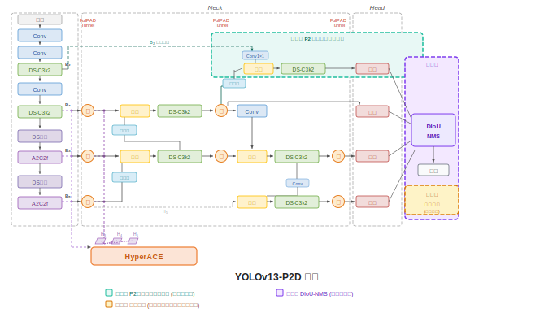

# YOLOv13-P2D: Improved YOLOv13 for Dense Apple Detection

基于改进的 YOLOv13 在复杂果园环境下的苹果目标检测模型。

> **本分支为可直接运行的完整项目**，克隆后按照下方步骤即可训练与推理。

## Architecture



三项改进：
- **P2 高分辨率检测头** (stride 4)：增强小目标苹果检测
- **场景化数据增强**：针对果园遮挡、光照、密集场景优化
- **DIoU-NMS**：减少密集场景中真实目标被误抑制

## Quick Start

### 1. 环境安装

```bash
git clone -b yolov13-P2D https://github.com/susongyuan/YOLOv13-P2D.git
cd YOLOv13-P2D
pip install -e yolov13-main/
```

要求：Python >= 3.9, PyTorch >= 2.0, CUDA 推荐

### 2. 数据集准备

下载 [MinneApple](https://rsn.umn.edu/projects/orchard-monitoring/minneapple) 数据集，按以下结构组织：

```
MinneApple/
  yolo/
    images/
      train/   # .png 图像
      val/
    labels/
      train/   # YOLO格式 .txt 标注
      val/
    data.yaml
```

### 3. 训练 (A5 全组合方案)

```bash
python train_apple_yolov13_improved.py \
  --model-config yolov13-main/ultralytics/cfg/models/v13/yolov13s-apple-p2.yaml \
  --pretrained yolov13-main/yolov13s.pt \
  --data MinneApple/yolo/data.yaml \
  --cfg yolov13-main/ultralytics/cfg/experiments/apple_orchard_improved.yaml \
  --name a5_full
```

### 4. 验证

```bash
python eval_comprehensive.py
```

### 5. 推理可视化

```python
from ultralytics import YOLO
model = YOLO("runs_ablation/a5_full_p2_aug_diou/weights/best.pt")
results = model.predict("your_image.jpg", conf=0.25, imgsz=960)
results[0].show()
```

## 消融实验结果

| 变体 | P2头 | 场景增强 | DIoU-NMS | mAP50 | mAP50-95 | Recall |
|---|---|---|---|---|---|---|
| A0 (基线) | — | — | — | 0.9062 | 0.4937 | 0.8418 |
| A1 | ✓ | — | — | 0.9019 | 0.4834 | 0.8313 |
| A2 | — | ✓ | — | 0.9082 | 0.4910 | 0.8379 |
| A3 | — | — | ✓ | 0.9062 | 0.4937 | 0.8418 |
| A4 | ✓ | ✓ | — | 0.9052 | 0.4783 | 0.8260 |
| **A5** | **✓** | **✓** | **✓** | **0.9074** | **0.4864** | **0.8405** |

## 关键文件

| 文件 | 说明 |
|---|---|
| `yolov13-main/ultralytics/cfg/models/v13/yolov13s-apple-p2.yaml` | P2检测头模型配置 |
| `yolov13-main/ultralytics/cfg/experiments/apple_orchard_improved.yaml` | A5训练超参 |
| `train_apple_yolov13_improved.py` | 训练入口脚本 |
| `eval_comprehensive.py` | 完整评估脚本 |
| `yolov13_p2d_architecture.svg` | 模型架构图 |

## Dataset

[MinneApple](https://github.com/nicolaihaeni/MinneApple) — 明尼苏达大学果园苹果检测基准数据集

## Citation

```bibtex
@article{chi2025yolov13,
  title={YOLOv13},
  author={Lei, Menglin and others},
  year={2025}
}
```

## Author

苏颂原 (Su Songyuan) — 广东技术师范大学, 2026
