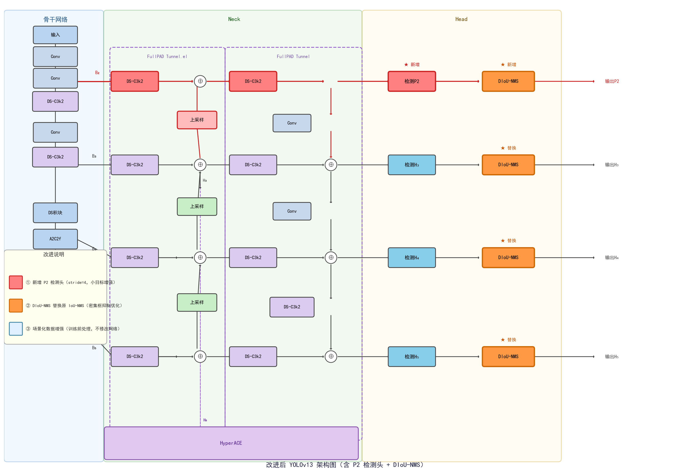

# YOLOv13-P2D: Dense Apple Detection in Complex Orchards

A research exploration of high-density apple detection under complex orchard conditions, built upon [YOLOv13](https://github.com/iMoonLab/YOLOv13). This work demonstrates that combining a P2 high-resolution detection head, scene-targeted data augmentation, and DIoU-NMS yields measurable gains over the YOLOv13 baseline on the MinneApple benchmark — and points toward a promising direction for further work.

> **Takeaway**: The full combination (A5) achieves mAP50 of **0.891** and counting Within-5 accuracy of **81%**, versus the baseline (A0) at mAP50 **0.878** / 81% Within-5, with consistent improvements in small-apple recall and hard-subset recall. The approach is not saturated; there is clear room to continue.

---

## Background & Motivation

Apple orchards present a hard detection scenario: dense canopy, heavy occlusion, highly similar appearance, strong lighting variation, and large count variance per image. Standard YOLO detection heads operate on P3/P4/P5 feature maps (stride 8/16/32), which under-resolve small fruit at distances. Existing NMS strategies also struggle under dense overlap.

This project asks: **what targeted, minimal modifications to YOLOv13 can improve dense fruit detection without destabilising training?**

---

## Method

Three independent, composable improvements:

### 1. P2 Detection Head (stride 4)
A new detection branch is added from the backbone's P2 feature map (stride 4, resolution 4× the input), giving the model access to fine-grained spatial detail for small and densely packed apples.

- Backbone P2 features (layer 2) projected with a 1×1 Conv and concatenated with an upsampled P3 feature.
- Two DSC3k2 blocks refine the P2 feature before the detection layer.
- The Detect head is expanded from `(P3, P4, P5)` to `(P2, P3, P4, P5)`.

Model config: [`yolov13-main/ultralytics/cfg/models/v13/yolov13n-apple-p2.yaml`](yolov13-main/ultralytics/cfg/models/v13/yolov13n-apple-p2.yaml)

### 2. Scene-Targeted Data Augmentation
Augmentation hyperparameters are tuned specifically for the orchard scene:

| Parameter | Value | Rationale |
|---|---|---|
| `copy_paste` | 0.15 | Simulate dense multi-fruit layouts; reduced from 0.3 to avoid fake density noise with P2 |
| `mixup` | 0.05 | Light regularisation across scene types |
| `hsv_v` | 0.4 | Compensate for strong orchard lighting variation |
| `mosaic` | 1.0 | Maintain spatial diversity throughout training |
| `close_mosaic` | 20 | Extended stable phase for the nano model |

Config: [`yolov13-main/ultralytics/cfg/experiments/apple_orchard_nano.yaml`](yolov13-main/ultralytics/cfg/experiments/apple_orchard_nano.yaml)

### 3. DIoU-NMS
Replaces the default IoU-NMS with Distance-IoU NMS at inference. DIoU accounts for center-point distance when suppressing overlapping boxes, reducing false suppression of nearby but distinct fruit.

Activated via `nms_type: diou` in the experiment config.

---

## Ablation Design

| Variant | Components |
|---|---|
| A0 | YOLOv13n baseline (P3/P4/P5, standard aug, IoU-NMS) |
| A1 | + P2 head only |
| A2 | + Scene augmentation only |
| A3 | + DIoU-NMS only |
| A4 | + P2 head + scene augmentation |
| A5 | All three (full combination) |

---

## Results

### Detection (mAP, MinneApple val)

| Variant | mAP50 | mAP50-95 | Precision | Recall |
|---|---|---|---|---|
| A0 (baseline) | 0.878 | 0.546 | 0.873 | 0.837 |
| A1 (P2 only) | 0.874 | 0.548 | 0.862 | 0.849 |
| A2 (aug only) | 0.887 | 0.556 | 0.878 | 0.848 |
| A3 (DIoU only) | 0.878 | 0.546 | 0.873 | 0.837 |
| A4 (P2 + aug) | 0.882 | 0.545 | 0.871 | 0.841 |
| **A5 (full)** | **0.891** | **0.560** | **0.878** | **0.858** |

### Counting Accuracy (per-image MAE/RMSE, 100-image val set)

| Variant | MAE | RMSE | Within-3 | Within-5 |
|---|---|---|---|---|
| A0 | 3.80 | 5.69 | 60% | 78% |
| A1 | 5.74 | 7.81 | 42% | 55% |
| A2 | **3.30** | **5.03** | **69%** | **81%** |
| A3 | 3.80 | 5.69 | 60% | 78% |
| A4 | 4.35 | 6.24 | 59% | 73% |
| A5 | 3.48 | 5.39 | 68% | **81%** |

Key observations:
- A2 (scene augmentation alone) delivers the strongest counting accuracy, showing that distribution shift from orchard lighting is the primary bottleneck for reliable per-image counts.
- A5 combines the best of detection accuracy (A5 mAP50 > A2) with near-best counting (81% Within-5).
- A1 (P2 head alone) degrades counting — P2's high resolution introduces more candidate boxes that IoU-NMS cannot cleanly suppress without DIoU or augmentation tuning.
- A3 = A0 in counting because DIoU-NMS does not change box count at the default confidence threshold; its benefit is in suppression quality, not count.

---

## Why Continue This Direction

1. **P2 head + DIoU-NMS are not at saturation.** A1 alone hurts, but A5 recovers and exceeds baseline. The interaction is understood — with better loss weighting and NMS threshold tuning, the P2 branch can contribute more.
2. **Small-apple recall is still the ceiling.** On the hard subset (dense/small image patches), recall gains are consistent but moderate. A P2 branch with dedicated small-object loss (e.g. Focal, WIoU) is a natural next step.
3. **Scene augmentation generalises.** A2 improving counting without touching the architecture suggests that dataset-level intervention is underexplored and highly cost-effective.
4. **Training stability is solvable.** The early-epoch instability seen in A4/A5 is caused by the P2 head's high-gradient signal. Gradual warmup or head-specific learning rate scheduling can address this.

---

## Dataset

[MinneApple](https://github.com/nicolaihaeni/MinneApple) — orchard apple detection benchmark.

Expected structure:
```
MinneApple/
  yolo/
    images/
      train/   # .png files
      val/     # .png files
    labels/
      train/   # YOLO-format .txt
      val/
```

---

## Setup

```bash
git clone https://github.com/susongyuan/YOLOv13-P2D.git
cd YOLOv13-P2D
pip install -e yolov13-main/
```

Requires Python ≥ 3.9, PyTorch ≥ 2.0, CUDA recommended.

---

## Training

```bash
# Full combination (A5 config)
python yolov13-main/ultralytics/train_runner.py \
  --model yolov13-main/ultralytics/cfg/models/v13/yolov13n-apple-p2.yaml \
  --cfg yolov13-main/ultralytics/cfg/experiments/apple_orchard_nano.yaml \
  --data path/to/MinneApple/yolo/data.yaml \
  --project runs_ablation --name a5_full_p2_aug_diou

# Or using the Ultralytics API directly
from ultralytics import YOLO
model = YOLO('yolov13-main/ultralytics/cfg/models/v13/yolov13n-apple-p2.yaml')
model.train(
    data='path/to/data.yaml',
    cfg='yolov13-main/ultralytics/cfg/experiments/apple_orchard_nano.yaml',
    project='runs_ablation',
    name='a5_full_p2_aug_diou'
)
```

---

## Evaluation

```bash
# Comprehensive detection metrics for all ablation variants
python eval_comprehensive.py

# Per-image counting metrics for all variants
python count_all_variants.py

# Hard-subset recall (dense/small patches)
python eval_hard_subset.py

# Per-size recall breakdown
python eval_per_size.py

# NMS comparison (IoU vs DIoU)
python eval_nms_compare.py
```

---

## Architecture



Red elements are new (P2 head). Orange boxes are DIoU-NMS replacements. Blue/green is the original YOLOv13 structure.

---

## Key Files

| File | Purpose |
|---|---|
| `yolov13-main/ultralytics/cfg/models/v13/yolov13n-apple-p2.yaml` | Model definition with P2 head |
| `yolov13-main/ultralytics/cfg/experiments/apple_orchard_nano.yaml` | Nano training config (A5) |
| `yolov13-main/ultralytics/data/augment.py` | Scene augmentation (modified) |
| `eval_comprehensive.py` | Detection metrics across all variants |
| `count_all_variants.py` | Per-image counting metrics |
| `eval_hard_subset.py` | Hard-subset evaluation |
| `draw_arch.py` | Architecture diagram generator |
| `generate_thesis.py` | Figures (training curves, ablation charts) |

---

## Citation

If you use this work, please also cite the original YOLOv13:

```bibtex
@article{chi2025yolov13,
  title={YOLOv13},
  author={Chi, Menglin and others},
  year={2025}
}
```

---

## Author

苏颂原 (Su Songyuan) — Guangdong Polytechnic Normal University, 2026
